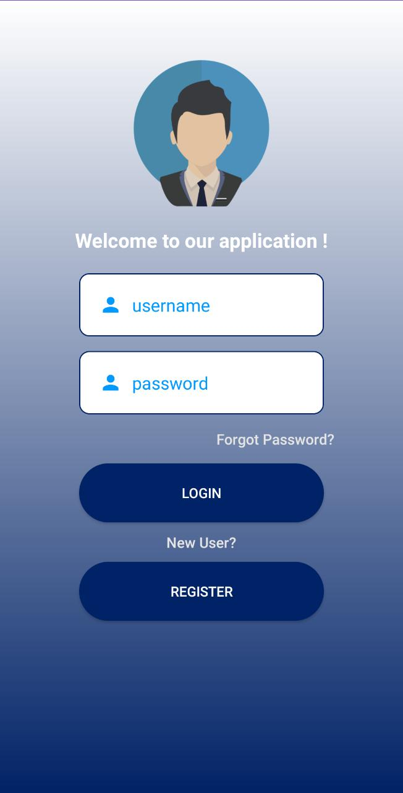
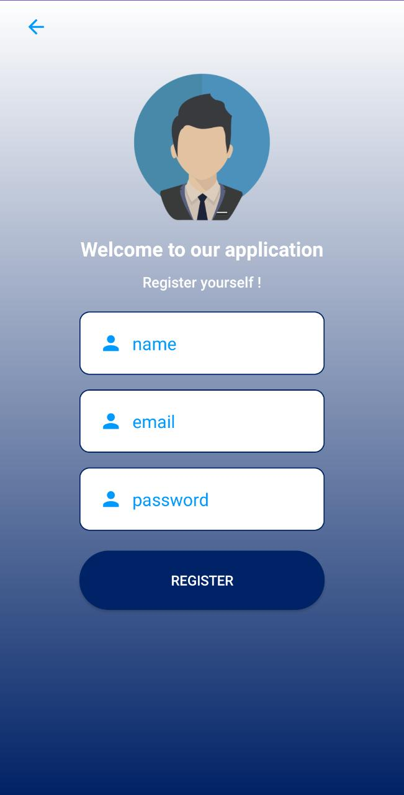
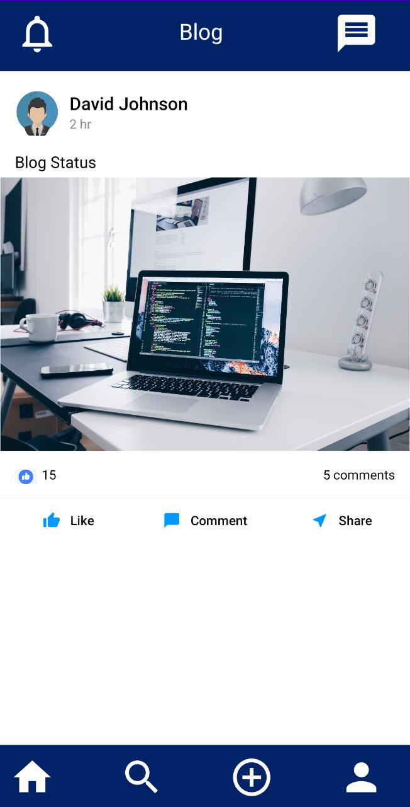
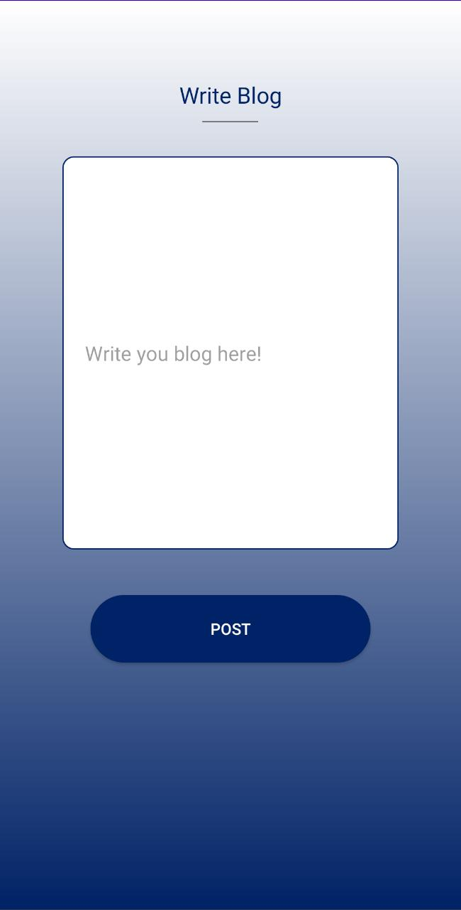
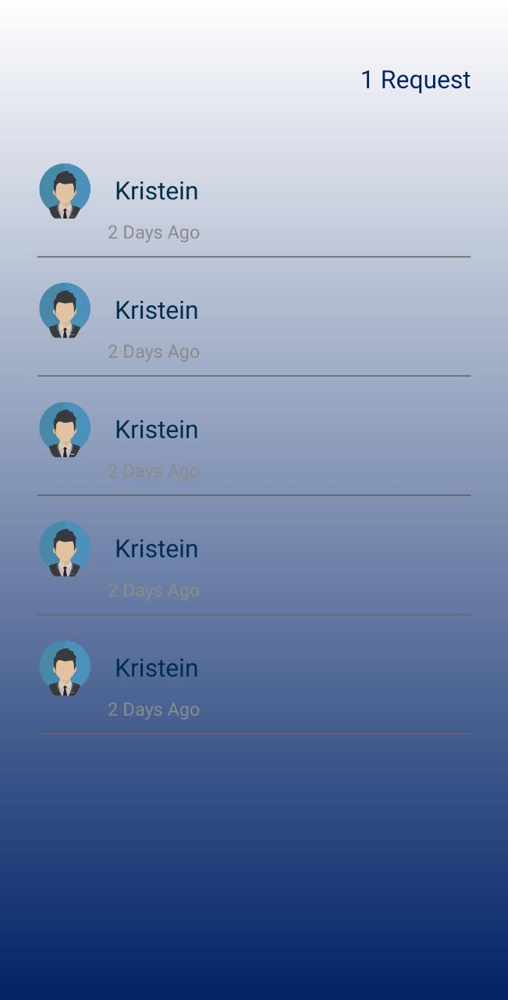

* Blogging Application UI *

* Android Application created using XML and JAVA

* Blogging Application UI 

* Few images are here:

1. SplashScreen

2. Login Page

2. Registeration Page

2. Home Page

2. Profile Page

2. Write Blog Page

2. Messaging Page

2. Login Page

2. Login Page

